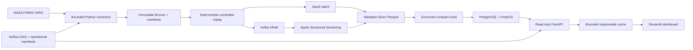

# Architecture

## Version 1.0 Local architecture

ASTRAYAN is a governed Earth Observation event platform built around NASA FIRMS VIIRS data. The complete local path is verified at one million controlled replay messages derived from 10,000 distinct NASA detections. A separate ten-million replay-generation experiment is verified, while its Spark batch attempt is explicitly blocked by the measured local JVM heap ceiling.

## Data truth and scale

| Claim | Verified boundary |
|---|---|
| Original NASA population | Deterministic selection of 10,000 distinct `VIIRS_SNPP_SP` detections |
| Full local platform | 1,000,000 `NASA_REPLAY` event messages; 10,000 detections replayed 100 times |
| Local replay generation | 10,000,000 deterministic messages; 10,000 detections replayed 1,000 times |
| Local 10M Spark | Not verified; failed safely at the 3-GiB JVM heap boundary |
| AWS | Architecture and CloudFormation prepared; no deployment, workload, or cost |

Every event preserves `source_type`, `source_dataset`, `source_record_id`, `is_synthetic`, `ingestion_run_id`, `event_timestamp`, and `ingestion_timestamp`. Event-message count and underlying-detection count are never conflated.

## Component responsibilities

| Component | Responsibility and boundary |
|---|---|
| Extractor | Bounded NASA access, retries, raw-byte checksums, immutable manifests, secret-safe errors |
| Canonicalizer | Explicit event schema, stable identities, validation, rejection, lineage, deterministic output |
| Replay generator | Streaming deterministic replay with stable plan/event identities and preserved NASA truth |
| Kafka | Six-partition replay topic plus rejected and dead-letter topics; stable lineage key and bounded retention |
| Spark batch | Explicit schema, DataFrame validation, stable-key deduplication, Silver partitioned Parquet, exact read-back |
| Structured Streaming | Explicit offsets, broker metadata, watermark, checkpoints, separate outcomes, zero-input recovery |
| Gold | Compact authoritative Parquet, aggregates, checksums, partitioned PostgreSQL load boundary |
| PostgreSQL/PostGIS | Rebuildable 47-column serving projection, SRID 4326 geometry, GiST/B-tree indexes, load controls |
| Airflow | One fixed production-style DAG, bounded parameters/retries/timeouts, stable identities, operational receipts |
| FastAPI | Six GET-only contracts, read-only role, parameterized SQL, bounded pagination/time/spatial queries |
| Cache | Process-local 60-second aggregate cache with entry/byte bounds, bypass, and PostgreSQL fallback |
| Dashboard | API-only recruiter-facing operational, time-series, map, and lineage views |

## Storage zones

- Bronze: immutable source and replay JSONL plus checksummed manifests.
- Silver: accepted partitioned Parquet; rejected and duplicate records remain separate.
- Gold: authoritative compact Parquet, daily/lineage aggregates, and checksum-addressed database load parts.
- PostgreSQL/PostGIS: disposable serving projection rebuildable from admitted Gold.
- Generated scale data, manifests, checkpoints, databases, and logs remain under ignored local paths.

## Reliability and security

- Stable IDs and content hashes make reruns comparable and conflicts detectable.
- Writes use immutable physical run paths or transactional database promotion.
- Kafka offsets, Spark read-back, Gold manifests, database counts, geometry, and aggregates reconcile independently.
- PostgreSQL API sessions are forced read-only; write attempts fail.
- No source secret enters Git, manifests, logs, screenshots, or API responses.
- CI verifies locked direct dependencies, tests, imports, Compose/Dockerfile contracts, secrets, generated-data exclusion, and documentation links.

## AWS Version 1.1 boundary

CloudFormation defines budget-first controls, private KMS-encrypted S3, least-privilege IAM, private networking, bounded EMR Serverless, and CloudWatch visibility. It has not been deployed. Five-million and ten-million managed Spark gates, RDS/PostGIS recovery, actual cost, and teardown evidence are Version 1.1 milestones. Current AWS cost is exactly $0.00.
