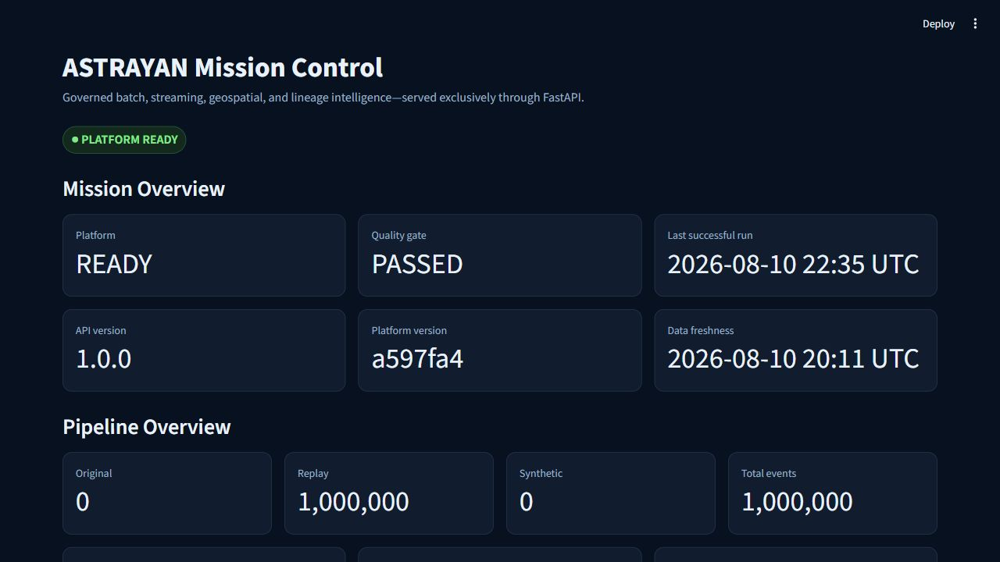
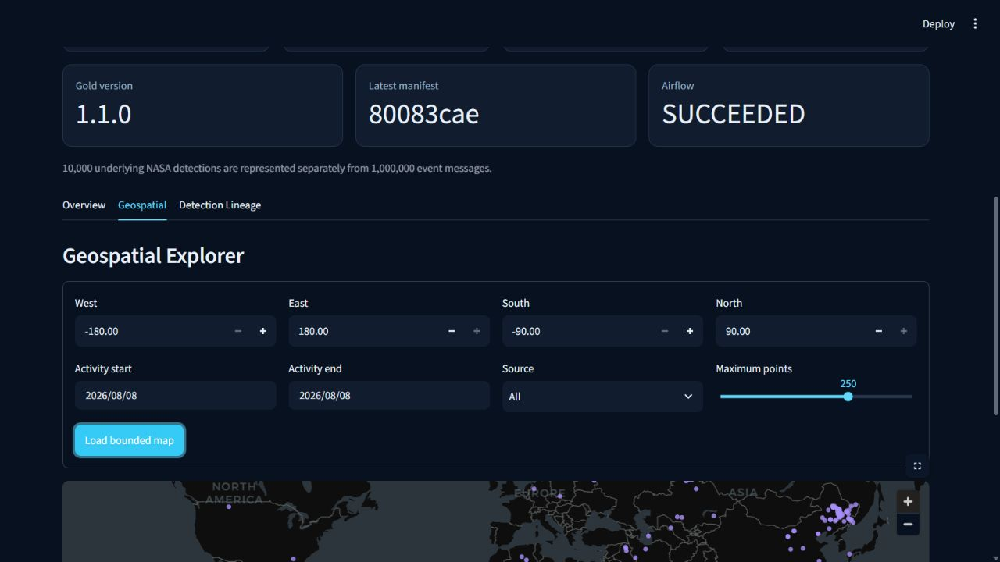
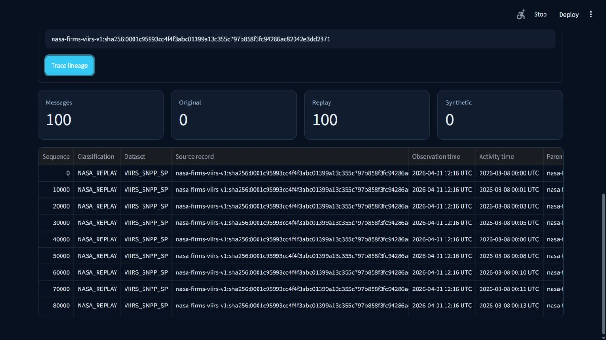

# NASA Earth Observation Event Intelligence Platform

## Version 1.0 Local

Version 1.0 Local is a production-style data-engineering portfolio release. The complete platform is verified end to end at **1,000,000 controlled replay events**, representing 10,000 original NASA FIRMS detections replayed exactly 100 times. The verified path includes deterministic replay, Spark batch, Kafka, Spark Structured Streaming recovery, governed Gold, PostgreSQL/PostGIS, Airflow, read-only FastAPI, bounded caching, and a Streamlit dashboard.

The separate 10-million experiment proves deterministic generation and independent read-back of **10,000 original NASA detections replayed 1,000 times**. It does not prove local 10M Spark processing: the bounded attempt reached a verified JVM heap ceiling and produced no admitted Spark output. AWS architecture and infrastructure definitions are prepared but were not deployed. Actual AWS project cost is **$0.00**. Managed 5M and 10M execution is deferred to Version 1.1.

## Mission

Build a professional batch and streaming data-engineering platform for approximately 10 million NASA-derived Earth Observation event messages.

The final workload will contain a documented mixture of:

- Original NASA records
- Enriched records
- Controlled replay events
- Explicitly labeled synthetic scale-test records

## Architecture

Official NASA source -> Python extraction -> Bronze storage -> controlled replay and synthetic generation -> Kafka -> Spark validation, deduplication, and enrichment -> Silver Parquet -> Gold aggregates -> PostgreSQL/PostGIS -> API and dashboard.

The detailed component diagram, storage contracts, trust boundaries, and deployment boundary are in [ARCHITECTURE.md](ARCHITECTURE.md).

## Engineering status

- Architecture: implemented locally through governed Gold
- Repository foundation: complete
- NASA extraction: bounded 21-record smoke test passed
- Canonical events: 21 accepted, 0 rejected, 0 duplicate; deterministic rerun passed
- Local vertical slice: passed through PostgreSQL/PostGIS at 100,000 replay messages
- AWS deployment: architecture and IaC prepared; no authenticated deployment, resources, or workload; actual cost $0.00
- Largest verified official NASA selection: 10,000 original NASA detections
- Largest verified replay processing gate: 1,000,000 messages representing 10,000 NASA detections exactly 100 times each
- Largest completed serving gate: 1,000,000 replay messages representing 10,000 NASA detections
- Airflow orchestration: one fixed production-style DAG; bounded integration and same-identity rerun passed
- FastAPI: six GET-only endpoints; one-million-row integration, permissions, GiST plan, and latency gates passed
- 10M local experiment: deterministic JSONL generation and independent verification passed; bounded Spark attempt failed at the JVM heap ceiling and is not an admitted scale result
- Current release: `v1.0.0-local`; cloud 5M/10M execution is deferred to Version 1.1

Local measurements and limitations are recorded in `PERFORMANCE_REPORT.md` and `reports/quality/`. No cloud-deployment claim should be inferred.

## Verified scale and performance

| Gate | Verified result | Key measurement |
|---|---|---:|
| 1M complete local platform | Passed end to end | Spark batch 149.502 s; 6,688.88 events/s |
| 1M governed Gold | Passed | 167.959 s; 1,000,000 reconciled rows |
| 1M PostgreSQL/PostGIS rebuild | Passed | 408.006 s; 2,450.94 rows/s |
| 10M deterministic replay generation | Passed twice | 490.562 s and 461.594 s |
| 10M independent read-back | Passed | 1,819.625 s; 5,495.64 events/s |
| 10M local Spark | Not proven | JVM heap ceiling after approximately 629 s; no admitted output |
| AWS | Not executed | $0.00 actual cost |

See [PERFORMANCE_REPORT.md](PERFORMANCE_REPORT.md) and [EVIDENCE_INDEX.md](EVIDENCE_INDEX.md) for the complete measurements and immutable evidence references.

## Local setup and demo

1. Install Python 3.12, Java 17, Docker Desktop, and Docker Compose.
2. Create a project-local virtual environment and install the exact packages in `requirements.lock`.
3. Copy `.env.example` to an ignored `.env` and supply only local credentials; never commit it.
4. Validate the repository with `python tools/repository_audit.py` and run `python -m unittest discover -s tests -p "test_*.py"`.
5. Start only the required bounded Docker Compose service. Follow the phase evidence documents for governed replay, Spark, Kafka, PostgreSQL, Airflow, API, and dashboard demonstrations.
6. Run FastAPI with `uvicorn eo_event_platform.api.app:app`, then start the dashboard with `python -m streamlit run src/eo_event_platform/dashboard/app.py`.

Generated datasets belong under ignored local storage and must never be committed. The repository contains representative fixtures and evidence only.

## Recruiter walkthrough

- Begin with the architecture and scale-truth table above.
- Show the one-million reconciliation and performance evidence.
- Demonstrate bounded API and dashboard views using the preserved serving projection.
- Explain the 10M Spark OOM as an experimentally measured local capacity boundary, not a success claim.
- Close with recovery evidence, CI controls, least-privilege API access, and the $0 AWS ledger.

Quantified resume bullets and interview talking points are in [INTERVIEW_GUIDE.md](INTERVIEW_GUIDE.md). The screenshots below are admitted Version 1.0 documentation assets.

## AWS boundary

The planning-only AWS contract is documented in `docs/phase_9/PHASE_9A_AWS_EXECUTION_PLAN.md`. It fixes one-region private execution through encrypted S3, EMR Serverless, temporary RDS PostgreSQL/PostGIS, one-off Fargate loader/verifier tasks, CloudWatch, and a budget-first teardown process. The required cost ledger is `AWS_COST_REPORT.md`.

No AWS resource has been created. Managed execution is deferred to Version 1.1 and requires a new explicit approval, authenticated preflight, confirmed budget, live validation, and teardown evidence.

The deployable foundation is under `infrastructure/aws/`. It uses AWS-native CloudFormation, is locked to `us-east-1`, starts no job, and contains no credential or real notification address. Local validation and tests can run without AWS access. Live validation, deployment, notification confirmation, and teardown require an explicitly approved MFA-backed AWS session.

## Airflow Phase 7

The only DAG is `nasa_eo_batch_vertical_slice_v1`. It is manually triggered, accepts a reconciled gate size up to one million, permits one active run, and applies bounded retries and explicit timeouts. The fixed order is extraction, canonical transformation, controlled replay, Spark processing, Gold generation, PostgreSQL/PostGIS load, and verification.

Airflow 3.3.0 is installed with `requirements-airflow.txt` and the official Python 3.12 constraints file. Because Apache Airflow does not support native Windows execution, local DAG tests and `dag.test()` run in the official `apache/airflow:3.3.0-python3.12` Linux image. Runtime databases, logs, and manifests remain under ignored `data/local/airflow/`.

The `integration` profile is capped at 100 records and verifies orchestration, XCom handoff, metadata, checksums, and rerun behavior only. It is not a NASA, Spark, Gold, or PostgreSQL scale claim. The `local` profile invokes preapproved Phase 6 commands supplied as JSON argument arrays in `ASTRAYAN_<STAGE>_COMMAND` environment variables; secrets are not accepted as DAG parameters or XCom values.

## FastAPI Phase 8A

The Version 1.0 API exposes only:

- `GET /health/ready`
- `GET /v1/platform/status`
- `GET /v1/summary`
- `GET /v1/daily`
- `GET /v1/lineages/{lineage_root_id}`
- `GET /v1/events/bbox`

All event activity filters use `coalesce(scheduled_replay_timestamp, event_timestamp)`. Observation timestamps remain separately labeled. Lineage and spatial results use seek cursors with maximum limits of 100 and 500 respectively; daily aggregates are limited to 200 rows, bounding-box activity ranges to seven days, and summary/daily ranges to 31 days.

Set `EO_API_DATABASE_DSN` to the untracked `eo_api_runtime` credential and run `uvicorn eo_event_platform.api.app:app`. The readiness endpoint refuses an owner, superuser, or writable database session. Event-serving responses never expose raw object paths, governed event hashes, database errors, or credentials; the operational endpoint exposes only the explicitly approved Gold manifest checksum.

Set `EO_OPERATIONAL_METADATA_ROOT` to the Phase 7 immutable run-manifest directory for the operational endpoint. `/v1/platform/status` combines that bounded metadata with the safe one-row PostgreSQL operational view and cache aggregate status. It returns no filesystem paths, cache keys or values, credentials, SQL, secrets, or infrastructure configuration.

## API cache Phase 8B

Only validated successful platform-summary and daily-aggregate responses use the replaceable in-process cache. The fixed local policy is a 60-second TTL, 256 entries, 65,536 bytes per entry, 4,194,304 total serialized bytes, and LRU eviction. Deterministic keys contain only canonical validated request parameters. `Cache-Control: no-cache` or `no-store` safely bypasses cache reads and writes. Any cache failure falls through to the unchanged read-only PostgreSQL path; health, lineage, bounding-box detail, invalid requests, and failed operations are never cached.

## Dashboard Phase 8C.2

The dark, desktop-first Streamlit dashboard consumes only the six documented FastAPI GET routes. It presents mission and pipeline truth, daily activity, health/cache/Airflow status, a seven-day and 500-point bounded geospatial explorer, and a 100-event bounded lineage search. It contains no database connection, SQL, local operational metadata read, production mock, or copied aggregation logic.

Set `EO_DASHBOARD_API_BASE_URL` to the FastAPI origin and run:

```text
python -m streamlit run src/eo_event_platform/dashboard/app.py
```






