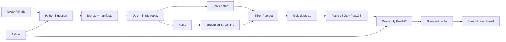

# NASA Earth Observation Event Intelligence Platform

I built this batch and streaming data platform to turn NASA FIRMS observations into traceable, queryable Earth Observation events. The complete system is verified locally at **1,000,000 events**, using Python, Kafka, Spark, Airflow, PostgreSQL/PostGIS, FastAPI, and Streamlit.

> **Scale at a glance:** 1M events verified through the full platform · 10K underlying NASA detections · 6,688.88 events/s in the 1M Spark batch · deterministic 10M generation verified separately

## Why I Built This

Earth Observation data is a useful engineering workload because it combines geospatial fields, time-based processing, lineage, and meaningful data-quality constraints. I chose NASA FIRMS VIIRS data and built the surrounding system to demonstrate the parts of data engineering that are often missing from simple ETL demos: deterministic identities, replayable workloads, batch and streaming paths, recovery, serving, and measurable scale boundaries.

The project never treats replayed messages as new NASA observations. It keeps event volume separate from the 10,000 underlying NASA detections used for the scale tests.

## What the Platform Does

1. Extracts a bounded NASA FIRMS dataset and stores immutable Bronze data with checksums.
2. Converts source rows into explicit canonical events with stable identities and lineage.
3. Generates controlled replay events for repeatable scale and streaming tests.
4. Validates, deduplicates, and enriches events with Spark batch and Structured Streaming.
5. Writes partitioned Silver Parquet and governed Gold outputs.
6. Rebuilds a compact PostgreSQL/PostGIS serving layer from admitted Gold data.
7. Orchestrates the batch path with Airflow and serves bounded read-only queries through FastAPI.
8. Presents operational, temporal, geospatial, and lineage views in Streamlit.

## Architecture



NASA FIRMS → Python ingestion → Kafka → Spark / Structured Streaming → Silver / Gold → PostgreSQL/PostGIS → Airflow → FastAPI → bounded cache → Streamlit

See [ARCHITECTURE.md](ARCHITECTURE.md) for component boundaries, storage contracts, and the AWS deployment design.

## Dashboard

| Mission overview | Geospatial explorer | Detection lineage |
|---|---|---|
|  |  |  |
| Platform health, data freshness, source classification, and daily activity | PostGIS-backed bounding-box queries with time and source filters | Source detection, replay chain, timestamps, and classifications |

The dashboard reads only the six bounded FastAPI endpoints. It contains no direct database connection, hidden SQL, or duplicated aggregation logic.

## Key Engineering Decisions

- **Deterministic replay:** I used controlled replay to test scale and streaming behavior without misrepresenting replay events as original observations.
- **Explicit schemas and identities:** Stable event, detection, and lineage IDs make deduplication and reconciliation independently verifiable.
- **Gold as the authority:** Parquet remains the governed analytical record; PostgreSQL/PostGIS is a rebuildable serving projection.
- **Idempotent loading:** Manifest checksums, staged promotion, and content-conflict detection make reruns safe and observable.
- **PostGIS serving:** GiST-backed spatial queries support bounded map requests without introducing a separate geospatial service.
- **Least-privilege API:** FastAPI uses a forced read-only database role, parameterized SQL, strict limits, and validated request/response models.
- **Replaceable caching:** Only bounded aggregate responses are cached, with fixed TTL and memory limits plus safe PostgreSQL fallback.
- **Operational recovery:** Kafka offsets, Spark checkpoints, Airflow receipts, and database load identities preserve truth across restarts and reruns.

## Verified Results

The two scale claims are intentionally separate:

| Scope | Verified result |
|---|---:|
| **Full platform** | **1,000,000 events end to end** |
| Underlying NASA FIRMS detections | 10,000 |
| Replay frequency in the 1M gate | 100 events per detection |
| 1M Spark batch | 149.502 seconds |
| 1M Spark throughput | 6,688.88 events/second |
| 1M governed Gold rows | 1,000,000 reconciled |
| 1M PostgreSQL/PostGIS rebuild | 408.006 seconds; passed |
| **Generation and verification only** | **10,000,000 deterministic replay events** |
| 10M generation | Verified twice with identical SHA-256 |
| 10M independent read-back | Verified |
| 10M local Spark | Not claimed; reached the measured JVM memory boundary |
| AWS deployment and workload | Not run |
| Actual AWS cost | **$0.00** |

The 10M experiment used 10,000 NASA detections replayed 1,000 times. Generation and independent verification passed, but the bounded local Spark attempt exhausted its 3 GiB JVM heap before producing an admitted output. The complete platform claim therefore remains one million events. Detailed measurements are in [PERFORMANCE_REPORT.md](PERFORMANCE_REPORT.md).

## Reliability & Data Quality

- Canonical schemas validate required fields, types, coordinates, timestamps, and classifications.
- Stable identities support deterministic deduplication and replay reconciliation.
- Every scale gate distinguishes original, replay, and explicitly synthetic events.
- Manifests record row counts, checksums, run identities, and output locations.
- Spark, Kafka offsets, Parquet read-back, Gold manifests, and serving counts reconcile independently.
- Identical database reloads insert zero rows; conflicting content fails transactionally.
- Recovery tests preserve Kafka offsets, serving counts, aggregates, and load identity after restart.
- GitHub Actions validates dependencies, tests, imports, container definitions, secrets, documentation links, and generated-data exclusions.

## Tech Stack

| Area | Technologies |
|---|---|
| Ingestion and contracts | Python 3.12, NASA FIRMS API, JSON/JSONL, explicit schemas |
| Streaming | Apache Kafka 4.3.1 in KRaft mode, Spark Structured Streaming |
| Distributed processing | PySpark 4.0.2, Apache Spark, Parquet |
| Orchestration | Apache Airflow 3.3.0 |
| Serving | PostgreSQL 16, PostGIS 3.4, FastAPI, bounded in-process cache |
| Presentation | Streamlit |
| Platform | Docker Compose, GitHub Actions |
| Cloud design | AWS S3, EMR Serverless, CloudWatch, KMS, IAM, CloudFormation |

## Running Locally

Prerequisites: Python 3.12, Java 17, Docker Desktop, and Docker Compose.

```powershell
git clone https://github.com/Nitheesh2325/nasa-earth-observation-event-platform.git
cd nasa-earth-observation-event-platform
py -3.12 -m venv .venv
.\.venv\Scripts\Activate.ps1
python -m pip install --requirement requirements.lock
python -m pip install --no-deps --editable .
Copy-Item .env.example .env
python tools/repository_audit.py
python -m unittest discover -s tests -p "test_*.py"
```

Add the local NASA FIRMS key and database credentials to the ignored `.env` file. Generated datasets, checkpoints, databases, and runtime logs remain outside Git. The detailed execution plans under `docs/` describe the bounded Kafka, Spark, PostgreSQL, Airflow, API, and dashboard runs.

To run the serving applications after preparing the local database:

```powershell
uvicorn eo_event_platform.api.app:app
python -m streamlit run src/eo_event_platform/dashboard/app.py
```

## Repository Guide

| Document | Purpose |
|---|---|
| [ARCHITECTURE.md](ARCHITECTURE.md) | System design, component boundaries, and data flow |
| [PERFORMANCE_REPORT.md](PERFORMANCE_REPORT.md) | Runtime, throughput, storage, latency, and resource measurements |
| [EVIDENCE_INDEX.md](EVIDENCE_INDEX.md) | Index of scale, quality, recovery, and serving evidence |
| [INTERVIEW_GUIDE.md](INTERVIEW_GUIDE.md) | Concise project narrative, tradeoffs, and quantified resume bullets |
| [DATA_DICTIONARY.md](DATA_DICTIONARY.md) | Event, lineage, time, location, and serving definitions |
| [ENGINEERING_DECISIONS.md](ENGINEERING_DECISIONS.md) | Architectural decisions and their consequences |

## Engineering Tradeoffs & Limitations

This is a laptop-scale local release, not a high-availability production deployment. The complete platform is proven at one million events on bounded local services. The separate 10M experiment established that deterministic generation and verification fit locally while Spark processing exceeded the safe JVM memory envelope; I retained that result as a measured capacity boundary instead of increasing memory or claiming an incomplete run.

Local Kafka is a single KRaft broker and does not demonstrate broker failover. Performance measurements are sequential local benchmarks, not multi-user or cloud latency claims. AWS infrastructure is defined and locally validated, but no AWS resources were deployed and no cloud workload was executed.

## Future Work

Version 1.1 is intentionally limited to the already designed cloud execution: deploy the budget-controlled AWS foundation, run EMR Serverless compatibility checks, close managed 5M and 10M gates in order, capture CloudWatch and actual-cost evidence, and verify teardown. Version 1.0 incurred **$0.00** in AWS cost.
