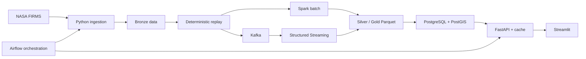

# NASA Earth Observation Event Intelligence Platform

I built this project around NASA FIRMS data to explore the full lifecycle of a geospatial event pipeline: ingestion, replay, batch and streaming processing, orchestration, serving, and visualization. The complete local pipeline is verified at **1,000,000 replay events** derived from 10,000 NASA detections.

**Python • Apache Kafka • Apache Spark • Airflow • PostgreSQL/PostGIS • FastAPI • Streamlit • Docker**

## Why I Built This

NASA FIRMS provides real-world observations with timestamps, geographic coordinates, and measurement fields. I wanted to build more than a one-step ETL script, so I used that data to test event identity, lineage, deduplication, recovery, geospatial queries, and repeatable performance measurements across an end-to-end data system.

Replay events are always labeled separately from their underlying NASA detections. This makes it possible to test larger workloads without presenting replayed messages as new observations.

## Architecture



NASA FIRMS → ingestion → Kafka → Spark → Parquet → PostgreSQL/PostGIS → FastAPI → Streamlit

Airflow coordinates extraction, transformation, replay, Spark processing, Gold generation, database loading, and verification. [ARCHITECTURE.md](ARCHITECTURE.md) describes the components and storage boundaries in more detail.

## What I Built

- A bounded Python extractor that records source checksums and keeps the NASA API key out of logs and Git.
- A canonical event model with explicit schemas, stable event IDs, detection IDs, source classification, and lineage.
- A deterministic replay generator for repeatable Kafka, Spark, and scale tests.
- Spark batch and Structured Streaming jobs for validation, deduplication, enrichment, and partitioned Parquet output.
- Explicit Kafka topics for replay, rejected events, and dead-letter records, with stable keys and bounded retries.
- Silver and Gold datasets with row counts and checksums that can be independently reconciled.
- A compact PostgreSQL/PostGIS serving model rebuilt from Gold data, with spatial and lineage indexes.
- One Airflow DAG with bounded parameters, retries, timeouts, stable run IDs, and safe reruns.
- Six read-only FastAPI endpoints for health, status, summaries, daily activity, spatial search, and lineage.
- A bounded cache for aggregate queries and a Streamlit dashboard that uses only the API.

## Results

The one-million and ten-million results measure different parts of the project:

| Measurement | Verified result |
|---|---:|
| **Complete local pipeline** | **1,000,000 replay events** |
| Underlying NASA FIRMS detections | 10,000 |
| Spark batch | 149.502 seconds |
| Measured Spark throughput | 6,688.88 events/second |
| PostgreSQL/PostGIS | 1M-row validation passed |
| **Separate 10M dataset experiment** | Generation and independent verification passed |
| 10M Spark processing | Not completed; local JVM memory limit exceeded |
| AWS deployment | Not deployed |
| Actual AWS cost | **$0.00** |

The complete system—including Kafka, Spark, Gold, PostgreSQL/PostGIS, Airflow, FastAPI, cache, and dashboard—was tested with one million events. The separate 10M experiment proved deterministic generation and read-back only; it is not a 10M Spark or serving claim. Full measurements are recorded in [PERFORMANCE_REPORT.md](PERFORMANCE_REPORT.md).

## Dashboard

| Mission overview | Geospatial explorer | Detection lineage |
|---|---|---|
|  |  |  |
| Health, freshness, source types, and activity | Bounded PostGIS queries with map filters | Original detection and replay history |

The dashboard does not connect directly to PostgreSQL. Every displayed value comes from a validated, bounded FastAPI response.

## Engineering Decisions

- **Deterministic IDs:** Stable event and lineage identities make reruns, deduplication, and independent verification possible.
- **Idempotent processing:** Run identities, checksums, staged database loads, and conflict detection prevent silent duplication or overwrite.
- **Schema validation:** Explicit schemas keep malformed coordinates, timestamps, classifications, and required fields out of Silver data.
- **Replay/source separation:** Event counts and underlying NASA detection counts are reported independently so scale claims remain clear.
- **Parquet between processing and serving:** Columnar Silver and Gold data remain the analytical source, while PostgreSQL is rebuildable.
- **PostGIS for spatial queries:** The source data is geographic, and GiST indexes support the dashboard's bounded map searches.
- **Read-only API access:** FastAPI uses a non-owner database role, parameterized SQL, response schemas, and strict result limits.
- **Bounded caching:** Only successful aggregate queries are cached, with fixed TTL, entry, and memory limits.
- **Airflow orchestration:** One DAG captures task order, retries, timeouts, run metadata, and rerun behavior without adding a framework around Airflow.
- **Recovery:** Kafka offsets, Spark checkpoints, Airflow receipts, and database load identities are checked after restart.

## Reliability and Testing

The repository has unit tests for ingestion, identity, replay, Spark schemas, Kafka behavior, Gold generation, database loading, API validation, caching, infrastructure definitions, and dashboard states. Integration evidence covers Kafka offsets, Spark output read-back, PostGIS query plans, read-only database permissions, Airflow reruns, and service recovery.

GitHub Actions installs pinned dependencies, checks imports and packaging, runs the portable test suite, validates Docker and Compose files, scans for secrets, checks documentation links, and rejects tracked generated datasets. The local release suite ran 108 tests: 100 passed and eight environment-dependent tests were skipped in the portable environment.

## Running Locally

Prerequisites: Python 3.12, Java 17, Docker Desktop, and Docker Compose.

```powershell
git clone https://github.com/Nitheesh2325/nasa-earth-observation-event-platform.git
cd nasa-earth-observation-event-platform
py -3.12 -m venv .venv
.\.venv\Scripts\Activate.ps1
python -m pip install --requirement requirements.lock
python -m pip install --no-deps --editable .
Copy-Item .env.example .env
python tools/repository_audit.py
python -m unittest discover -s tests -p "test_*.py"
```

Add the NASA FIRMS key and local database credentials to the ignored `.env` file. Generated data, checkpoints, databases, and logs remain outside Git. The execution notes under `docs/` contain the bounded commands for individual services.

After preparing the local PostgreSQL database:

```powershell
uvicorn eo_event_platform.api.app:app
python -m streamlit run src/eo_event_platform/dashboard/app.py
```

## Project Structure

```text
├── contracts/       Event, source, Kafka, Silver, and Gold contracts
├── dags/            Airflow orchestration
├── docs/            Technical decisions, data definitions, evidence, and execution notes
├── infrastructure/  Docker Compose, database migrations, and AWS definitions
├── reports/quality/ Verification and performance evidence
├── src/              Python ingestion, processing, serving, and dashboard packages
├── tests/            Unit, integration, and representative fixtures
├── ARCHITECTURE.md
├── PERFORMANCE_REPORT.md
└── README.md
```

## Limitations and Next Steps

The 10M Spark run exceeded the JVM heap available on my local machine. Because of that measured limit, complete local validation remains at one million events; the 10M result covers deterministic generation and independent verification only.

Local Kafka uses one KRaft broker, so it does not demonstrate broker failover or high availability. The recorded timings are local, sequential measurements rather than multi-user load tests.

AWS infrastructure for S3, EMR Serverless, CloudWatch, IAM, KMS, and cost controls is designed and locally validated but has not been deployed. Future work is to run managed 5M and 10M Spark tests in order, capture actual cloud cost and monitoring evidence, and tear the resources down. Current AWS cost is **$0.00**.
