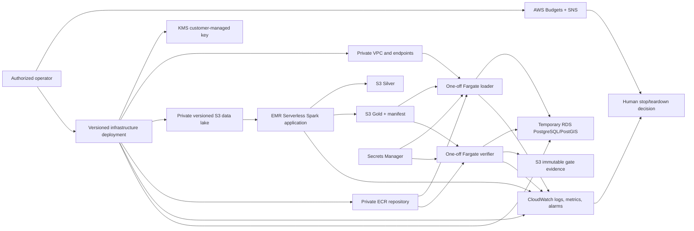

# Phase 9A AWS Execution Plan

## Status and authority

**Status:** Verified planning baseline; no infrastructure created and no AWS workload executed.

This document is the implementation contract for the Version 1.0 AWS scale gates. It preserves the approved architecture and does not authorize deployment by itself. Phase 9B may begin only after the owner authorizes spend and the budget, identity, quota, and teardown preflight has passed.

## 1. Exact AWS architecture

### Scope

- Region: `us-east-1` only.
- Workload: the admitted controlled-replay data path at 5,000,000 records, followed by 10,000,000 only after the 5M gate closes.
- Truth: scale rows remain `NASA_REPLAY` unless an existing contract explicitly labels a row synthetic; neither gate may be presented as millions of original NASA observations.
- Persistent authority: encrypted S3 Bronze, Silver, Gold, manifests, and evidence.
- Processing: Amazon EMR Serverless release `emr-spark-8.0.0` with Spark 4.0.2.
- Serving proof: temporary Amazon RDS for PostgreSQL 16 with the supported PostGIS 3.4 patch.
- Load and independent verification: one-off Amazon ECS tasks on AWS Fargate.
- Observability: Amazon CloudWatch metrics, logs, alarms, dashboard, and AWS Budgets notifications.
- Container registry: one private Amazon ECR repository for the loader/verifier image.
- Secrets: AWS Secrets Manager; no credential in source, task definitions, S3 manifests, logs, or screenshots.
- Encryption: one customer-managed KMS key for S3, RDS, ECR, CloudWatch Logs, and Secrets Manager where supported.
- Network: one VPC (`10.42.0.0/16`) with two private subnets (`10.42.10.0/24`, `10.42.20.0/24`) in distinct Availability Zones. No public database, public subnet, NAT gateway, internet gateway, bastion, ALB, or inbound SSH.
- Private connectivity: S3 gateway endpoint plus interface endpoints for ECR API, ECR Docker, CloudWatch Logs, Secrets Manager, and STS. Endpoints are created only for the execution window and removed during teardown.

Managed Kafka, EKS, Glue, Athena, Redshift, Lambda, a public FastAPI tier, and cloud dashboard hosting are outside Version 1.0 Phase 9. Local Kafka evidence is already complete; adding MSK would introduce cost and scope without being required for the cloud scale proof.

### Service dependency diagram



### Resource inventory and lifecycle

| Resource | Quantity | Lifetime | Required configuration |
|---|---:|---|---|
| AWS Budget | 1 | Persistent through both gates | Monthly cost budget, 50/80/100% actual and 80/100% forecast notifications |
| SNS topic | 1 | Persistent through both gates | Budget and alarm email subscription confirmed before compute |
| KMS key | 1 | Persistent until retained evidence is migrated/deleted | Rotation enabled; scoped key policy |
| S3 data bucket | 1 | Persistent evidence boundary | Versioning, Object Ownership enforced, public access blocked, SSE-KMS, lifecycle |
| S3 log bucket | 1 | Until evidence acceptance | Versioning, public access blocked, SSE-KMS, short retention |
| VPC | 1 | Execution window | DNS support/hostnames enabled; no public route |
| Private subnets | 2 | Execution window | Separate AZs; no public IP assignment |
| VPC endpoints | 6 | Execution window | S3 gateway; ECR API/DKR, Logs, Secrets Manager, STS interfaces |
| EMR Serverless application | 1 | Per gate | Auto-start, 10-minute auto-stop, no preinitialized workers |
| ECR repository | 1 | Execution window | Immutable tags, scan on push, KMS encryption, lifecycle keep last 3 |
| ECS cluster | 1 | Execution window | Fargate only; no long-running service |
| Fargate tasks | 2 definitions | Per load/verification | Loader write role and verifier read-only role separated |
| RDS PostgreSQL | 1 | Per serving gate | Private, encrypted, PostgreSQL 16, PostGIS 3.4, 100 GiB gp3, deletion protection during gate |
| CloudWatch dashboard | 1 | Execution window | Cost, EMR, loader, RDS, and quality signals |

RDS uses Single-AZ only for the explicitly labeled, time-bounded portfolio scale gate. It is not a high-availability production claim. A real continuously available production deployment must use Multi-AZ as already specified in the Phase 6 architecture.

## 2. IAM roles and policies

No long-lived IAM access key is permitted. Human access uses an MFA-protected federated/SSO identity. Every role is tagged with project, environment, owner, and expiry date.

| Role | Trusted principal | Allowed actions | Explicitly excluded |
|---|---|---|---|
| `AstrayanDeploymentRole` | Approved SSO permission set | Create/update/delete only the named Phase 9 resources; `iam:PassRole` only for roles below | Account administration, users/access keys, unrelated resources, wildcard pass-role |
| `AstrayanEmrRuntimeRole` | EMR Serverless | Read admitted Bronze/artifacts; write only run-scoped Silver, Gold, quarantine, evidence, and EMR logs; KMS use; scoped CloudWatch metrics | Secrets, RDS, IAM, other buckets, delete admitted inputs |
| `AstrayanEcsExecutionRole` | ECS tasks | Pull the named ECR image, decrypt it, create/write the named task log groups, retrieve only injected secret values | S3 data access, RDS data access, infrastructure mutation |
| `AstrayanLoaderTaskRole` | ECS tasks | Read one admitted Gold run and manifest; read one loader secret; KMS decrypt; publish namespaced load metrics/evidence | Bronze/Silver writes, database owner use by API, bucket-wide deletes, IAM |
| `AstrayanVerifierTaskRole` | ECS tasks | Read the admitted Gold manifest; read a separate read-only verifier secret; write one run-scoped evidence prefix; publish quality metrics | Database writes, Gold mutation, loader credentials, infrastructure mutation |
| `AstrayanRdsMonitoringRole` | RDS monitoring | AWS-managed enhanced-monitoring policy only | Application data access |

Policy controls:

- Resource ARNs and S3 prefixes are explicit; no `Resource: "*"` except AWS actions that technically require it, each documented.
- S3 bucket policies deny non-TLS requests and deny object writes without the approved KMS key.
- KMS policy separates administration from use and grants only `Encrypt`, `Decrypt`, `GenerateDataKey`, and `DescribeKey` where needed.
- Permissions boundaries prevent workload roles from creating IAM resources or expanding themselves.
- The database loader uses a migration/loader credential only for the task lifetime. The verifier uses the existing read-only permission model. FastAPI owner credentials are never introduced.
- CloudTrail account-level audit logging is treated as an account prerequisite, not a project-created service.

## 3. S3 layout and contracts

Bucket names are globally unique and resolved at deployment as `astrayan-<account-id>-us-east-1-data` and `astrayan-<account-id>-us-east-1-logs`.

```text
s3://astrayan-<account-id>-us-east-1-data/
  artifacts/git_sha=<40-char-sha>/
    application_bundle.zip
    artifact_manifest.json
  bronze/source_dataset=VIIRS_SNPP_SP/
    acquisition_date=YYYY-MM-DD/ingestion_run_id=<uuid>/
      source/
      canonical/
      manifest.json
  bronze/replay/gate_count=<5000000|10000000>/
    replay_run_id=<uuid>/
      part-*.jsonl
      manifest.json
  quarantine/gate_count=<count>/run_id=<uuid>/reason=<reason>/
  silver/execution_profile=batch/gate_count=<count>/
    run_id=<uuid>/event_date=YYYY-MM-DD/part-*.snappy.parquet
  gold/gate_count=<count>/gold_run_id=<uuid>/
    event_detail/part-*.snappy.parquet
    dataset_daily_summary/part-*.snappy.parquet
    detection_lineage_summary/part-*.snappy.parquet
    postgres_load/part-*.jsonl
    manifest.json
  evidence/scale_gate=<5m|10m>/run_id=<uuid>/
    admission.json
    spark_metrics.json
    load_metrics.json
    verification.json
    query_plans/
    resource_inventory.json
    cost_snapshot.json

s3://astrayan-<account-id>-us-east-1-logs/
  emr-serverless/application_id=<id>/job_run_id=<id>/
  ecs/task_family=<loader|verifier>/date=YYYY-MM-DD/
  rds/export/date=YYYY-MM-DD/
```

Rules:

- Run prefixes are immutable after an admitted manifest is written. Corrections receive a new physical run ID.
- Every manifest records contract version, gate count, Git SHA, EMR release, source classification counts, object URI, byte count, row count, and SHA-256.
- The verifier recomputes checksums and counts; S3 object existence alone never constitutes admission.
- Silver and Gold use Snappy Parquet and retain explicit schemas. PostgreSQL JSONL is a transient governed load boundary and is deleted after database/evidence acceptance according to lifecycle.
- S3 Standard is used during active gates. Noncurrent objects and logs expire after 30 days; transient replay/load artifacts expire after 30 days only after evidence acceptance; admitted Parquet/evidence transitions to Standard-IA after 30 days and Glacier Instant Retrieval after 90 days. Lifecycle rules are reviewed before activation to avoid deleting the sole authoritative copy.
- No generated scale dataset is copied into Git.

## 4. EMR Serverless execution plan

### Compatibility preflight

1. Confirm `emr-spark-8.0.0` is available in `us-east-1` and still supplies Spark 4.0.2.
2. Run the existing representative fixture against the managed runtime before any scale input.
3. Validate Python-package compatibility with the managed runtime; do not assume the local Python 3.12 interpreter is the EMR system Python.
4. Submit the Git-SHA-addressed application artifact and verify its SHA-256.
5. Confirm the regional EMR Serverless vCPU quota. The documented default is 16 concurrent vCPUs; request a quota increase before the 10M gate rather than silently exceeding it.

### Application policy

- Architecture: Linux x86_64 standard workers; no custom image unless the managed runtime fails a verified dependency boundary.
- Auto-start: enabled. Auto-stop: 10 idle minutes. Preinitialized capacity: zero.
- Network: private subnets and S3 gateway endpoint.
- Runtime role: `AstrayanEmrRuntimeRole`.
- Retry: zero for data-quality or reconciliation failures; at most one operator-approved retry for a proven transient AWS failure, always with a new physical execution ID.
- Timeout: 60 minutes for 5M; 120 minutes for 10M.
- Dynamic allocation optimization: enabled; executor idle timeout 60 seconds.
- Logs: CloudWatch plus S3 log bucket.

| Gate | Maximum application capacity | Driver | Executors | Initial shuffle partitions | Gold/load target parts |
|---|---|---|---|---:|---:|
| 5M | 16 vCPU, 64 GiB, 200 GiB disk | 4 vCPU, 16 GiB, 50 GiB | Up to 3 x 4 vCPU, 16 GiB, 50 GiB | 64 | Parquet 16; JSONL 20 |
| 10M | 32 vCPU, 128 GiB, 400 GiB disk | 4 vCPU, 16 GiB, 50 GiB | Up to 7 x 4 vCPU, 16 GiB, 50 GiB | 128 | Parquet 32; JSONL 40 |

These are hard ceilings, not reserved workers. Partition counts are starting values derived from the one-million measurements and must be adjusted only when measured file sizes, skew, or shuffle evidence requires it.

### Ordered jobs

1. **Admission:** verify replay manifest, checksum, gate count, truth labels, and Git SHA; fail before writes on mismatch.
2. **Bronze to Silver:** apply the existing explicit schema, validation, stable-key deduplication, enrichment, and mutually exclusive accepted/rejected/duplicate outcomes.
3. **Silver verification:** independently read Parquet; reconcile event identities, 10,000 underlying detections, replay factor (500 or 1,000), sequence/iteration completeness, activity timestamps, and zero false original/synthetic claims.
4. **Gold build:** compact the admitted Silver data into existing event-detail, daily-summary, lineage-summary, and partitioned PostgreSQL load contracts.
5. **Gold admission:** independently hash every object and reconcile detail, aggregate, and per-part load counts.

The 5M gate must close with tests, counts, quality, runtime, cost, and limitations before the 10M job can be submitted.

## 5. PostgreSQL/PostGIS and load plan

- Engine: latest supported PostgreSQL 16 minor version available on execution day; enable the RDS-supported PostGIS 3.4 patch and record exact versions.
- Gate topology: private Single-AZ `db.m6g.xlarge` (4 vCPU, 16 GiB) unless the preflight benchmark demonstrates a smaller class satisfies the two-hour load window.
- Storage: 100 GiB encrypted gp3, autoscaling enabled with a hard maximum of 200 GiB. Record IOPS/throughput defaults and actual allocation.
- Connections: no public access; loader SG may connect to database SG on 5432; no CIDR-wide database ingress.
- Parameters: force SSL, retain autovacuum, export PostgreSQL and upgrade logs, enable Performance Insights for the free seven-day retention where available, and Enhanced Monitoring at 60 seconds only during the gate.
- Backup: automated backups with seven-day retention during the gate; final snapshot before destructive recovery rehearsal; deletion protection enabled until evidence acceptance.
- Load: the one-off 4-vCPU/16-GiB Fargate loader validates the admitted Gold manifest, streams bounded JSONL parts through PostgreSQL bulk-copy staging, promotes transactionally, and reconciles counts exactly.
- Verify: a separate 2-vCPU/8-GiB Fargate task uses a read-only credential and reruns identity, detection, replay, synthetic, geometry, aggregate, idempotency, conflict-rollback, query-plan, and latency gates.
- Recovery: restore the final snapshot to a temporary instance, run the bounded read-only verifier, record RTO/RPO evidence, and immediately delete the restored instance after acceptance.

## 6. CloudWatch monitoring and logging

### Log groups

| Log group | Retention | Content controls |
|---|---:|---|
| `/astrayan/v1/emr-serverless` | 30 days | Spark driver/executor events; no event payloads or secrets |
| `/astrayan/v1/ecs/loader` | 30 days | Stage counts, durations, run IDs, checksums only |
| `/astrayan/v1/ecs/verifier` | 30 days | Quality counters, plans, latency, reconciliation |
| `/aws/rds/instance/<identifier>/postgresql` | 14 days | PostgreSQL errors/slow statements; statement parameter logging disabled |

### Metrics, alarms, and dashboard

- Billing: `AWS/Billing EstimatedCharges`; alarms at $25 and $40, plus the AWS Budget thresholds.
- EMR: job state, failed jobs, running workers, allocated vCPU/memory/storage, job duration, and executor failures.
- Custom namespace `ASTRAYAN/V1`: admitted rows, accepted, rejected, duplicates, unique events, underlying detections, synthetic count, runtime, throughput, manifest mismatch, quality-gate status, database rows, invalid geometries, and aggregate delta.
- RDS: CPU >80% for 15 minutes, free storage <20 GiB, freeable memory <2 GiB, connections >80% of configured maximum, read/write latency, queue depth, and failed connections.
- ECS: task exit code, task duration, and loader/verifier success metric.
- Every alarm routes to the confirmed SNS subscription. Data-integrity alarms stop advancement; they never trigger an automatic retry.
- The CloudWatch dashboard displays budget, EMR capacity/runtime, data-quality reconciliation, loader status, RDS health, and final cost in one view.

Logs must use structured JSON, UTC timestamps, correlation fields (`gate_count`, `run_id`, `job_run_id`, `manifest_id`, `git_sha`), and redaction. Raw event payloads, database DSNs, secrets, local paths, tokens, and NASA API keys are prohibited.

## 7. Budget and cost estimates

### Cost-control gate

1. Create and confirm a **$50 monthly AWS Budget** before any non-free resource.
2. Send actual alerts at 50%, 80%, and 100%, and forecast alerts at 80% and 100%.
3. Create CloudWatch billing alarms at $25 and $40.
4. Use AWS Pricing Calculator with execution-day `us-east-1` rates and save the estimate to evidence.
5. Require an owner go/no-go if the calculator's worst-case two-gate estimate exceeds $45 or if current spend leaves less than a $10 contingency inside the budget.
6. Tag every resource with `Project=ASTRAYAN`, `Environment=portfolio-v1`, `Owner=Nitheesh2325`, `ManagedBy=<approved-tool>`, `CostCenter=portfolio`, `Gate=5m|10m`, and `ExpiresAt=<UTC>`.

### Planning estimate (USD, before tax and free-tier credits)

| Cost component | Assumption | 5M | 10M | Both-gate bound |
|---|---|---:|---:|---:|
| EMR Serverless | 16 vCPU/64 GiB for 0.75 h; 32 vCPU/128 GiB for 1.5 h; standard storage | $1-$3 | $4-$9 | $5-$12 |
| RDS PostgreSQL | `db.m6g.xlarge`, 100 GiB gp3, 6 h / 10 h including restore rehearsal | $3-$6 | $5-$10 | $8-$16 |
| Fargate loader/verifier | Linux x86, bounded 4/16 and 2/8 tasks, under 4 aggregate task-hours per gate | <$2 | <$3 | <$5 |
| S3 | Up to 40 GiB then 80 GiB active data plus requests for under one month | <$2 | <$3 | <$5 |
| CloudWatch | Under 5 GiB ingested logs, bounded metrics/alarms/dashboard | <$2 | <$3 | <$5 |
| Secrets, KMS, ECR | One secret pair, one key, under 2 GiB images, request charges | <$2 | <$2 | <$4 |
| Private interface endpoints | Five endpoints across two AZs, maximum 12 h / 18 h | $1-$3 | $2-$5 | $3-$8 |
| Contingency | Retry, slower runtime, snapshot/transfer variance | $3 | $5 | $8 |
| **Planning total** | Conservative time-bounded envelope | **$12-$23** | **$21-$40** | **$33-$45 target** |

These are planning bounds, not quotes. EMR Serverless bills consumed vCPU, memory, and configured storage per second with a one-minute minimum; Fargate bills requested CPU, memory, and extra ephemeral storage per second; RDS, S3, CloudWatch, endpoints, KMS, ECR, and Secrets Manager add separate charges. The execution-day Calculator estimate and Cost Explorer actuals are authoritative. The actual project AWS cost is currently **$0.00** because no resources have been created.

## 8. Resource teardown and recovery strategy

### Teardown order

1. Stop new submissions; capture job IDs, manifests, CloudWatch metrics, logs, and cost snapshot.
2. Verify all Fargate tasks have stopped and delete task definitions/cluster after evidence export.
3. Stop and delete the EMR Serverless application after job terminal state and log delivery.
4. Run final RDS verification, create the named final snapshot, perform the restore rehearsal, then delete the restored instance.
5. After owner evidence acceptance, disable deletion protection and delete the gate RDS instance; retain only the named snapshot for seven days, then delete it.
6. Delete interface VPC endpoints immediately; delete security groups, subnets, and VPC after dependency checks.
7. Delete unneeded ECR images/repository after recording digests.
8. Export required CloudWatch evidence, then delete dashboard, alarms, and project log groups after retention requirements are met.
9. Delete transient replay and PostgreSQL-load S3 objects only after checksum-admitted Parquet/evidence exists and the owner accepts the gate. Retain governed evidence per lifecycle.
10. Schedule KMS-key deletion only after every retained encrypted object/snapshot has been deleted or re-encrypted. Keep Budget/SNS until final billing settles.

### Teardown verification

- Inventory all project-tagged resources with AWS Resource Groups Tagging API and service-specific lists.
- Confirm zero running EMR applications/jobs, ECS tasks/services, RDS instances/restores, interface endpoints, NAT gateways, load balancers, or public IPs.
- Confirm only explicitly retained S3 objects, RDS snapshot (during its seven-day window), KMS key, Budget, and SNS remain.
- Record final Cost Explorer actuals after billing data settles; `AWS_COST_REPORT.md` must distinguish estimated, accrued, and final cost.
- A teardown is incomplete while an hourly resource remains.

## 9. Security review

| Control area | Required control | Verification evidence |
|---|---|---|
| Identity | SSO/federation, MFA, no access keys, least privilege, separate workload roles | Credential report/identity summary and policy simulation |
| Network | Private RDS and tasks, no public IPs, SG-to-SG 5432 only, private endpoints | Route tables, endpoint list, SG rules, RDS public-access flag |
| Encryption | TLS in transit; SSE-KMS for data, logs, images, snapshots, secrets | Bucket/key policies, RDS/ECR/log settings, connection check |
| Secrets | Secrets Manager, separate loader/verifier credentials, no logs/manifests/source | Secret inventory metadata and repository secret scan |
| Data integrity | Immutable run IDs, SHA-256 admission, exact counts, conflict rollback, truth labels | Signed-off gate manifests and independent verification |
| Detection | CloudWatch alarms, structured logs, account CloudTrail prerequisite | Alarm test, SNS receipt, log sampling, CloudTrail status |
| Supply chain | Git-SHA artifact, immutable ECR digest, scan-on-push, pinned runtime | Artifact manifest, image digest, scan result, EMR release |
| Resilience | S3 versioning, RDS backups/PITR, snapshot restore rehearsal | Versioning state, backup settings, measured RTO/RPO |
| Cost abuse | Budget before compute, strict capacity ceilings, expiry tags, teardown inventory | Budget receipt, EMR max capacity, tags, zero-hourly-resource report |

Deployment is blocked by any public data resource, wildcard data-plane policy, unconfirmed budget notification, unscanned critical image finding, missing encryption, untracked secret, failed checksum, or unreconciled count.

## 10. Phase 9 implementation checklist

### 9B - deployment foundation

1. Reconfirm clean Git state and the admitted one-million baseline.
2. Reprice the plan in AWS Pricing Calculator and obtain owner spend authorization.
3. Verify SSO/MFA identity, account CloudTrail, service availability, quotas, and account limits.
4. Create the $50 Budget, SNS subscription, and billing alarms; prove notification delivery.
5. Implement versioned, reviewable infrastructure definitions using the repository's approved infrastructure tool; no console-only resource creation.
6. Pass static validation, least-privilege policy review, secret scan, and a zero-change preview.
7. Deploy KMS, buckets, logs, VPC/endpoints, roles, ECR, temporary RDS, ECS task definitions, and EMR application in dependency order.
8. Verify encryption, public-access blocks, routes, security groups, tags, retention, and capacity ceilings.

### 9C - managed compatibility smoke

9. Package the exact Git SHA and record checksums/digests.
10. Run the representative Spark fixture on EMR Serverless; reconcile schema and Parquet.
11. Run a bounded loader/verifier smoke against RDS/PostGIS; prove TLS and role separation.
12. Exercise one alarm and capture the SNS notification.
13. Teardown all hourly smoke resources and verify the inventory/cost snapshot.

### 9D - 5M gate

14. Admit the 5M replay manifest and record original/replay/synthetic truth.
15. Execute the ordered EMR jobs with the 16-vCPU ceiling.
16. Independently reconcile Silver and Gold identities, detections, replay factor, classifications, aggregates, checksums, runtime, throughput, files, and cost.
17. Rebuild temporary RDS/PostGIS from Gold; verify staging, inserted/final counts, geometry, GiST plan, aggregates, permissions, latency, idempotent reload, and conflict rollback.
18. Perform snapshot restore rehearsal and record RTO/RPO.
19. Run the full automated suite and close the 5M quality report.
20. Teardown hourly resources, reconcile actual cost, update required documentation, commit, and obtain gate approval.

### Phase 10 - 10M gate (blocked until 5M closes)

21. Confirm 32-vCPU quota and reprice/re-authorize remaining budget.
22. Admit and execute 10M with the same contracts and the 32-vCPU ceiling.
23. Repeat independent Spark, Gold, PostgreSQL/PostGIS, recovery, security, performance, and cost verification.
24. Teardown all hourly resources; reconcile final bill and retained-object inventory.
25. Run full tests, synchronize all required documentation/evidence, commit the final gate, and prepare GitHub/portfolio release evidence.

## Phase 9A verification record

- Repository inspected at baseline commit `4a36a4d33db1da8376355c23027f90e60c9a2cae`.
- Architecture reconciled with the project constraints, ED-004, ED-018 through ED-023, ED-028, and the Phase 6 AWS serving topology.
- Official AWS pricing/service pages were checked on 2026-08-10; execution-day pricing remains mandatory.
- No AWS CLI, SDK, Console, CloudFormation, Terraform, or service API call was executed.
- No credential was requested, displayed, written, or committed.
- Actual AWS cost at Phase 9A completion: `$0.00`.
